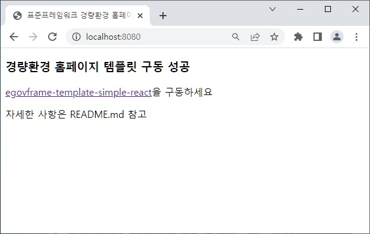

# 전자정부표준프레임워크 심플홈페이지 백엔드
- 백엔드 원본소스 : https://github.com/eGovFramework/egovframe-template-simple-backend
- 개발환경 : 표준프레임워크 4.1.0 ( https://www.egovframe.go.kr/home/sub.do?menuNo=94 )
- 위 개발개발환경에서 설치한 기존 심플홈페이지(참조: https://kimilguk.tistory.com/782)보다 경량이다.
- CRUD 작업용 API 컨트롤러만 제공 된다. 즉, 프런트엔드를 제어하는 페이지는 없다.
- 장점은 백엔드와 프런트엔드 프로젝트를 분리해서 작업할 수 있다.

- 참고로, 위 백엔드 소스는 수정하지 않고, 리액트용 프런트엔드 페이지만 수정할 예정 이다. 아래는 프런트 페이지 작업소스 이다.
- https://github.com/kimilguk/egovframe-template-simple-react.git

### 2023.04.11(화)
- 백엔드 원본 소스를 받아서 개발환경에서 실행 하고, 개인 gitignore 수정 후 깃 저장소에 올려보았다.
- 원본의 .github 폴더는 깃허브에서 workflow를 사용하는 설정이 있기 때문에 지운다.
- 참고로, 이클립스에서 최초 커밋 후 아래 2줄은 해당 프로젝트의 이클립스 터미널에서 실행 해 준다.(다음부턴 할 필요 없다.)
- git branch -M master
- git remote add origin https://github.com/학생의저장소주소.git

# 표준프레임워크 심플홈페이지 BackEnd


  


※ 본 프로젝트는 기존 JSP 뷰 방식에서 벗어나 BackEnd와 FrontEnd를 분리하기 위한 예시 파일로 참고만 하시길 바랍니다.

## 환경 설정

프로젝트에서 사용된 환경 프로그램 정보는 다음과 같다.
| 프로그램 명 | 버전 명 |
| :--------- | :------ |
| java | 1.8 이상 |
| maven | 3.8.4 |

## BackEnd 구동

### CLI 구동 방법

```bash
mvn spring-boot:run
```

### IDE 구동 방법

개발환경에서 프로젝트 우클릭 > Run As > Spring Boot App을 통해 구동한다.

### 구동 후 확인

구동 후, 브라우저에서 `http://localhost:포트번호/` 로 확인이 가능하다.  
초기 포트번호는 8080이며 `/src/main/resources/application.properties` 파일의 `server.port` 항목에서 변경 가능하다.  
또한, `http://localhost:포트번호/swagger-ui/index.html#/` 로 애플리케이션의 엔드포인트를 확인 가능하다.

## FrontEnd 구동 (React)

현재 FrontEnd는 React 관련 예제로 구성되어 있다.
[심플홈페이지FrontEnd](https://github.com/eGovFramework/egovframe-template-simple-react.git) 소스를 받아 구동한다.

## 변경 사항

### 1. [Java Config 변환](./Docs/java-config-convert.md)

#### 1) Web.xml -> WebApplicationInitializer 구현체로 변환

#### 2) context-\*.xml -> @Configuration 변환

#### 3) properties 변환(예정) boot 지원

### 2. API 변환

직접 View와 연결하던 방법에서 API 형식으로 변환 -> 다양한 프론트에서 적용 가능 하도록 예제 제공\
※ API를 사용한 Controller들은 ~ApiController.java에서 확인 가능합니다.
